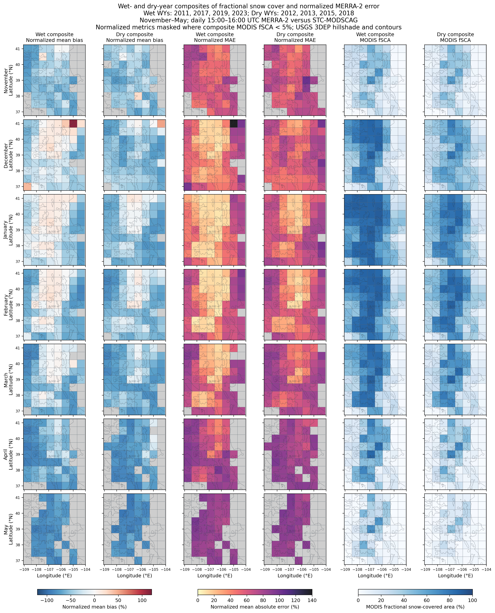
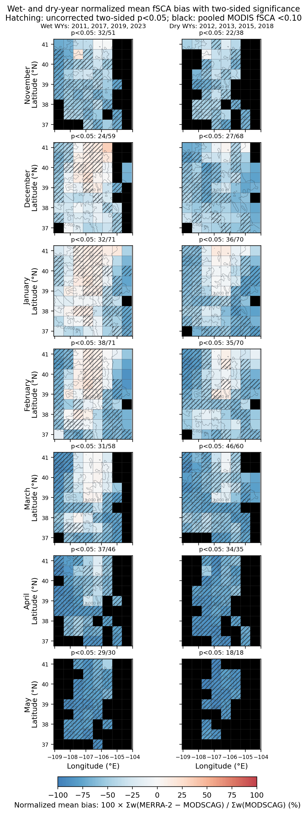

# Reanalysis / MODSCAG fractional snow-cover comparison

This project evaluates MERRA-2, ERA5, and ERA5-Land fractional snow-covered
area (fSCA) against the daily 500 m STC-MODSCAG product over Colorado. It
provides resumable, parallel pipelines for water years 2010–2023. The completed
MERRA-2 analysis also includes spatial and elevation-dependent error analyses,
wet/dry-year composites, and cellwise significance tests.

The configured domain contains 72 MERRA-2 cells: eight longitude columns by
nine latitude rows. Cell centers fall within 109–104°W and 37–41°N; because
those bounds select MERRA-2 centers, the complete grid-cell edges extend from
109.0625–104.0625°W and 36.75–41.25°N.

## Current analysis

- Period: water years 2010–2023.
- Reference: daily `STC_MODSCGDRF_HIST` v1 `snow_fraction` at 500 m.
- Model: MERRA-2 `M2T1NXLND` v5.12.4 `FRSNO` at time index 15.
- Comparison time: 15:00–16:00 UTC, timestamped 15:30 UTC.
- Spatial matching: MODSCAG pixel-center aggregation to the native
  0.625° × 0.5° MERRA-2 grid.
- Error sign: MERRA-2 minus MODSCAG.
- Parallelism: 16 monthly workers with at most eight simultaneous MODSCAG FTP
  connections.
- Persistence: monthly sufficient-statistic checkpoints and final results only;
  downloaded daily inputs are deleted immediately.

The MODSCAG product includes its documented spatiotemporal interpolation.
`days_without_observation` is retained as a coverage diagnostic rather than
used to discard the product's interpolated estimates.

The ERA extension uses the same daily support, pixel-center aggregation,
weighting, and model-minus-MODSCAG error definition. ERA5 is evaluated on its
CDS 0.25° grid (357 cells), and ERA5-Land on its CDS 0.1° grid (2,091 cells).
Sixteen monthly workers share eight MODSCAG FTP slots and four CDS retrieval
slots. Each day's MODSCAG downloads are reused for both grids. Monthly CDS
subsets and daily MODSCAG files are temporary; only monthly sufficient
statistics and complete final CSVs persist.

## Key results

The wet composite combines WY2011, 2017, 2019, and 2023. The dry composite
combines WY2012, 2013, 2015, and 2018.



The latest cellwise significance figure plots normalized mean bias. Hatching
marks an **uncorrected two-sided `p < 0.05`**; no FDR or other multiple-testing
correction is applied. Black cells have pooled MODIS fSCA below 0.10.



## Data and comparison contract

### MERRA-2

The model field is `FRSNO` from the hourly time-averaged land collection
`M2T1NXLND` v5.12.4. Production-stream filenames are resolved by date:

- stream 300 through 2010;
- stream 400 beginning in 2011; and
- reprocessed stream 401 for September 2020 and June–September 2021.

MERRA-2 is read remotely through Earthdata DAP4 and spatially subset before
transfer.

### ERA5 and ERA5-Land

The additional model fSCA values at 15:00 UTC are obtained as follows:

- ERA5 `reanalysis-era5-single-levels` `snow_depth` and `snow_density` on the
  CDS regular 0.25° grid
  ([DOI 10.24381/cds.adbb2d47](https://doi.org/10.24381/cds.adbb2d47)); and
- ERA5-Land `reanalysis-era5-land` on the CDS regular 0.1° grid
  ([DOI 10.24381/cds.e2161bac](https://doi.org/10.24381/cds.e2161bac)).

The standard ERA5 single-level archive does not expose `snow_cover`. Following
the official ERA5 documentation, the loader diagnoses the grid-box fraction as
`min(1, (1000 × snow_depth / snow_density) / 0.1 m)`, where snow depth is in
metres water equivalent and density is in kg m⁻³. ERA5-Land directly exposes
`snow_cover`; percent-encoded files are converted to a 0–1 fraction from their
NetCDF `units` metadata. Output metadata distinguishes diagnosed ERA5 fSCA from
direct ERA5-Land fSCA.

The ERA5 CDS grid is a regular-grid distribution product regridded from the
full ERA5 native representation. ERA5-Land's catalogue describes a 0.1°
distribution grid and 9 km native resolution. In both cases, MODSCAG is
aggregated directly to the grid supplied by the selected CDS product.

The timing is close but not mathematically identical to MERRA-2: ERA uses the
hourly field at 15:00 UTC, whereas the selected MERRA-2 value is the
15:00–16:00 UTC average stamped 15:30 UTC. Product and timing metadata remain
explicit in every checkpoint and output.

### MODSCAG and regridding

For each daily MODSCAG tile, the pipeline:

1. reads the native MODIS sinusoidal `x` and `y` coordinates;
2. transforms every 500 m pixel center to longitude and latitude;
3. assigns each center to exactly one cell of the selected model grid;
4. excludes fill values (`snow_fraction > 100`);
5. averages the remaining percentages within each model cell; and
6. masks the daily cell if valid coverage is below 80% of its expected MODSCAG
   pixel count.

This is pixel-center binning, not bilinear interpolation. Because the MODIS
sinusoidal pixels are equal area, the arithmetic mean is an equal-area cell
mean. Boundary pixels are assigned by their centers; fractional boundary
overlap is not calculated.

The shared mapping and reduction are implemented in
[`products.py`](src/merra_modis_comparison/products.py). The production call and
80% support masks are in
[`pipeline.py`](src/merra_modis_comparison/pipeline.py) for MERRA-2 and
[`reanalysis_pipeline.py`](src/merra_modis_comparison/reanalysis_pipeline.py)
for ERA.

Run the one-day diagnostic to see the native and target grids:

```bash
./plot_one_day_regridding.zsh
```

It downloads the three archived tiles for 15 January 2023 into a temporary
directory and writes
[`results/modscag_merra_grid_diagnostic_2023-01-15.png`](results/modscag_merra_grid_diagnostic_2023-01-15.png).

### Metrics

Let `M` be model fSCA, `R` be MODSCAG fSCA aggregated to that model cell, and
`w` be the valid MODSCAG pixel count. The pooled metrics are:

```text
bias = Σw(M - R) / Σw
MAE  = Σw|M - R| / Σw
NMB  = 100 × Σw(M - R) / ΣwR
NMAE = 100 × Σw|M - R| / ΣwR
```

Bias and MAE are reported in fSCA percentage points. NMB and NMAE are reported
as percentages of the paired MODSCAG snow signal. Weighting by valid 500 m
pixel count preserves fine-pixel area weighting across cells and dates.

## Installation and authentication

Python 3.12 is the tested environment; Python 3.11 or newer is supported.

```bash
python -m pip install -e '.[test]'
```

NASA Earthdata authentication is required for MERRA-2. Configure either a
standard `~/.netrc` entry or the `EARTHDATA_TOKEN` environment variable. The
pipeline never accepts credentials as command-line arguments and never writes
them to results. The MODSCAG FTP archive is public.

ERA access requires a Copernicus Climate Data Store personal access token and
acceptance of the ERA5 and ERA5-Land licences. Follow the official
[CDS API setup guide](https://cds.climate.copernicus.eu/how-to-api), then create
`~/.cdsapirc`:

```yaml
url: https://cds.climate.copernicus.eu/api
key: <PERSONAL-ACCESS-TOKEN>
```

`CDSAPI_KEY` can be used instead. The key is read only by `cdsapi`; it is never
written to repository files or passed as a command-line argument.

The included `.zsh` launchers currently point to the local tested interpreter:
`/Users/clintonalden/miniconda3/envs/env1/bin/python`. Replace that path with the
Python executable for another environment if needed.

## Run MERRA-2

### Preflight

Validate authentication, product access, coordinates, timing, and variables:

```bash
python -m merra_modis_comparison \
  --start-water-year 2010 --end-water-year 2023 \
  --preflight-only
```

### Run to completion

```bash
./run_to_completion.zsh
```

Equivalent command:

```bash
python -m merra_modis_comparison \
  --start-water-year 2010 --end-water-year 2023 \
  --west -109 --east -104 --south 37 --north 41 \
  --workers 16 --ftp-connections 8
```

### Run for about 30 minutes and resume

```bash
./run_30min.zsh
```

The runtime limit stops scheduling new months but lets in-flight months finish
and save atomic checkpoints. Wait for the `paused cleanly` message before
shutting down. Re-running the same command validates and skips completed months.

Each calendar month is an independent recoverable task. A checkpoint is reused
only after its schema, scientific configuration, cell identities, counts,
metrics, and domain-from-cell reconstruction pass validation. Interrupted
temporary files are never treated as completed months. Failed months are moved
to the back of the queue for another attempt.

The 16 processes share an eight-slot MODSCAG FTP gate because the archive rejects
ten or more simultaneous connections from one IP. Connection-limit responses
receive a staggered backoff.

## Run ERA5 and ERA5-Land

After configuring CDS authentication, validate both real products before a
download campaign:

```bash
/Users/clintonalden/miniconda3/envs/env1/bin/python \
  -m merra_modis_comparison.reanalysis_cli \
  --models era5 era5-land \
  --start-water-year 2010 --end-water-year 2023 \
  --preflight-only
```

The preflight checks the exact 15Z timestamp, ERA5 depth/density diagnostic,
ERA5-Land `snow_cover`, units, 0–1 range, coordinate order, model-grid identity,
and number of cells that can meet the MODSCAG archive-support rule. Run the full
comparison with:

```bash
./run_era5_era5_land_to_completion.zsh
```

Equivalent command:

```bash
/Users/clintonalden/miniconda3/envs/env1/bin/python \
  -m merra_modis_comparison.reanalysis_cli \
  --models era5 era5-land \
  --start-water-year 2010 --end-water-year 2023 \
  --west -109 --east -104 --south 37 --north 41 \
  --workers 16 --ftp-connections 8 --cds-connections 4
```

Calendar months are shared work units: MODSCAG is downloaded once and reduced
to each requested model grid. Checkpoints are model-specific, so a completed
ERA5 month is retained if only ERA5-Land needs to resume. Set
`--max-runtime-minutes` for an interruptible run. The runner stops scheduling
new months at the limit, finishes in-flight tasks, and resumes from validated
monthly CSVs on the next identical command.

For the rectangular center-selection domain, 354 of 357 ERA5 cells and 2,079
of 2,091 ERA5-Land cells can theoretically meet 80% support from the historical
MODSCAG archive. The southeastern edge intersects unavailable tile `h10v05`;
affected cells are left unpaired rather than filled or extrapolated.

### ERA5-Land WY2023 spatial normalized bias and MAE

After the ERA5-Land-only WY2023 trial completes, reproduce its November–May
14-panel normalized spatial figure with:

```bash
./plot_era5_land_wy2023_spatial.zsh
```

The figure plots NMB and NMAE on shared November–May scales, masks cells where
paired monthly MODSCAG fSCA is below 5%, and uses the same subtle USGS 3DEP
hillshade and labeled 2,000/3,000 m contours as the MERRA-2 figure. It contains
the 2,091 ERA5-Land 0.1° cells. If its slightly wider DEM is absent, run
`./download_era5_land_coarse_dem.zsh` first. The plot writes
`results/era5_land_wy2023_nov_may_spatial_bias_mae.png`.

The ERA runner is adapter-based. A new regular latitude/longitude CDS product
starts with a reviewed `ReanalysisModelSpec` in
[`reanalysis_config.py`](src/merra_modis_comparison/reanalysis_config.py); its
dataset-specific request keys and NetCDF variable/coordinate conventions must
then pass the same preflight and contract tests. A different grid type, time
operator, or fSCA definition is a scientific extension, not a registry-only
change.

## Derived analyses

### November 2022–May 2023 spatial and elevation dependence

```bash
./plot_nov2022_may2023_spatial.zsh
```

This validates seven monthly checkpoints and writes:

- `results/nov2022_may2023_spatial_bias_mae.png`
- `results/nov2022_may2023_elevation_dependency.png`

The spatial figure uses subtle USGS 3DEP hillshade and labeled 2,000 and 3,000 m
contours. Refresh the included 100 × 90 EPSG:4326 DEM with
`./download_coarse_dem.zsh`.

### Wet- and dry-year composites

```bash
./plot_wet_dry_composites.zsh
```

The launcher builds or resumes 56 monthly MODSCAG-only statistic checkpoints,
then combines comparison and MODSCAG statistics into November–May composites.
It writes:

- `results/wet_dry_composite_spatial_bias_mae.png`
- `results/wet_dry_composite_elevation_dependency.png`

The spatial figure contains MODIS fSCA, normalized mean bias, and normalized MAE
for every month and year group. The elevation figure shows the dependence of the
same quantities on cell-mean elevation. Composite normalized metrics are masked
where MODIS fSCA is below 5%.

### Wet/dry cellwise normalized-bias tests

```bash
./plot_bias_significance.zsh
```

For each wet/dry group, month, and MERRA-2 cell, the test uses the four annual
NMB values as independent replicates. It is a two-sided one-sample t-test of
mean annual NMB against zero, with three degrees of freedom when all four years
are available.

- Color: pooled normalized mean bias,
  `100 × Σw(MERRA-2 - MODSCAG) / Σw(MODSCAG)`.
- Hatching: raw, uncorrected two-sided `p < 0.05`.
- Black: pooled group-month MODIS fSCA below 0.10.
- No FDR or other multiple-testing correction is applied.

Outputs:

- `results/wet_dry_pixel_normalized_bias_two_sided_ttest.png`
- `results/wet_dry_pixel_normalized_bias_two_sided_ttest.csv`

The CSV retains the plotted NMB, mean annual NMB, pooled MODIS fSCA, mask,
t statistic, raw p value, raw significance decision, sample size, and degrees
of freedom for each cell.

## Output inventory

| Output | Contents |
| --- | --- |
| `results/water_year_2010_2023_monthly_checkpoints/` | 168 resumable monthly comparison-statistic CSVs |
| `results/water_year_2010_2023_overall_stats.csv` | Domain-wide monthly, seasonal, and water-year summaries |
| `results/water_year_2010_2023_pixel_stats.csv` | Monthly and seasonal results for all 72 MERRA-2 cells |
| `results/water_year_2010_2023_bias_mae.png` | Multi-year bias and MAE summary |
| `results/wet_dry_modis_fsca_monthly_checkpoints/` | MODSCAG-only sufficient statistics used by composites |
| `results/wet_dry_composite_spatial_bias_mae.png` | Wet/dry monthly spatial composites |
| `results/wet_dry_composite_elevation_dependency.png` | Wet/dry elevation dependence |
| `results/wet_dry_pixel_normalized_bias_two_sided_ttest.*` | Cellwise NMB map, raw p values, and decisions |
| `results/modscag_merra_grid_diagnostic_2023-01-15.png` | Native-to-MERRA regridding diagnostic |
| `results/era5_modis_water_year_2010_2023_monthly_checkpoints/` | ERA5 resumable monthly sufficient-statistic CSVs |
| `results/era5_modis_water_year_2010_2023_{overall,pixel}_stats.csv` | ERA5 monthly/seasonal domain and 0.25° cell statistics |
| `results/era5_land_modis_water_year_2010_2023_monthly_checkpoints/` | ERA5-Land resumable monthly sufficient-statistic CSVs |
| `results/era5_land_modis_water_year_2010_2023_{overall,pixel}_stats.csv` | ERA5-Land monthly/seasonal domain and 0.1° cell statistics |
| `results/era5_land_wy2023_nov_may_spatial_bias_mae.png` | ERA5-Land WY2023 November–May NMB and NMAE maps; paired MODSCAG fSCA ≥ 5% |

Daily MODSCAG granules and model subsets are never cached. The ERA monthly
checkpoints also retain weighted MODSCAG and error sums, allowing bias, MAE,
MODSCAG mean fSCA, normalized mean bias, and normalized MAE to be rebuilt
without raw model fSCA. Final CSVs and figures are written atomically only after
all required checkpoints pass validation.

## Guidance for future agents

[`AGENTS.md`](AGENTS.md) records the repository-wide scientific invariants,
workflow expectations, validation requirements, and code-review rules. The
repo-local
[`snow-hydrology-fsca-evaluation`](.agents/skills/snow-hydrology-fsca-evaluation/SKILL.md)
skill preserves the domain reasoning behind the product match, regridding,
metrics, masks, wet/dry composites, significance tests, figures, and resumable
execution. Codex can select it automatically for matching tasks, or it can be
invoked explicitly as `$snow-hydrology-fsca-evaluation`.

## Verification

```bash
python -m pytest -q
```

The current suite contains 44 tests covering configuration, model-grid
construction, CDS request and NetCDF handling, regridding, statistics,
checkpoint validation, plotting, composites, and significance calculations.

## Research-plan-implement record

- [`research/FSCA_PRODUCT_NOTES.md`](research/FSCA_PRODUCT_NOTES.md)
- [`plan/FSCA_PIPELINE_PLAN.md`](plan/FSCA_PIPELINE_PLAN.md)
- [`plan/MULTIYEAR_2010_2023_PLAN.md`](plan/MULTIYEAR_2010_2023_PLAN.md)
- [`research/ERA5_PRODUCT_NOTES.md`](research/ERA5_PRODUCT_NOTES.md)
- [`plan/ERA5_ERA5_LAND_PLAN.md`](plan/ERA5_ERA5_LAND_PLAN.md)
